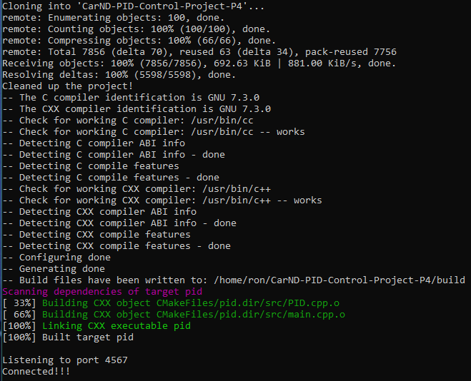
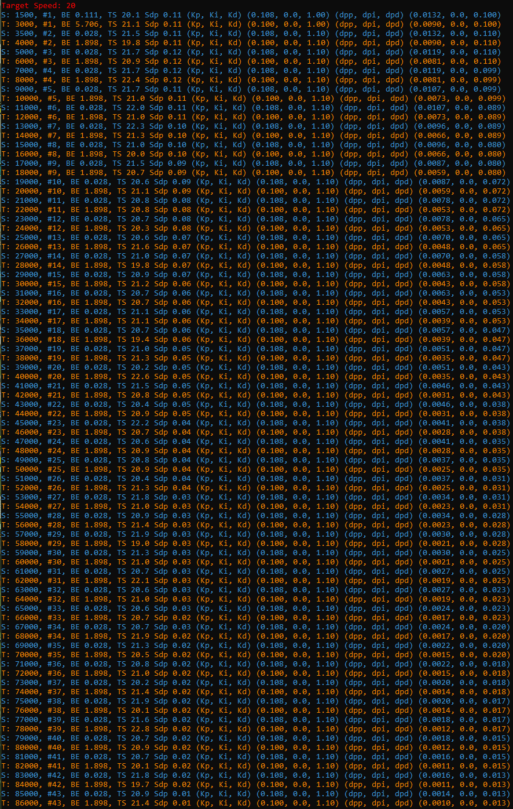
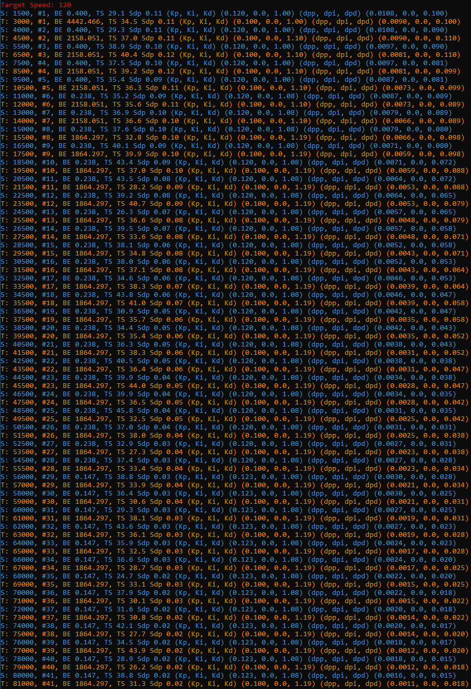

Project 4, Term 2: PID Controller
=======================

Final Result
------------

Compiling
---------

#### Code must compile without errors using cmake and make.

The code compiles without errors; however it generates numerous warnings. To correct this issue, CMakeLists.txt was modified as follows:

| From:                                | To:                                     |
|--------------------------------------|-----------------------------------------|
| set(CMAKE_CXX_FLAGS "\${CXX_FLAGS}") | set(CMAKE_CXX_FLAGS "\${CXX_FLAGS} -w") |

After the above modification, the [cmake] and [make] output looks good:

Implementation
--------

**The PID procedure follows what was taught in the lessons.**

-------------------

The purpose of this project was to build a PID controller and tune the PID hyperparameters by applying the general processing flow as described in the lessons, and to test the solution on the simulator. The simulator provides cross-track error (CTE), speed, and steering angle data via a local websocket. The PID (proportional/integral/differential) controller must drive the vehicle reliably around the simulator track.

The logic in main.cpp and PID.cpp, based on the algorithms taught in the lessons, reliably drives the vehicle around the simulator track.

---------------

Reflection
-----------------------------

**Describe the effect each of the P, I, D components had in your implementation.**

A recording of the video is shown at the top of this page.  The target speed was set to 20 mph.

The P(roportional) component causes the controller to react in a proportional, but opposite direction from the error.  This enables the controller to counteract errors continously as the vehicle moves. This component has the highest impact on the controller. 

The D(ifferential) component minimizes the P component's tendency to overcorrect when reacting to errors. A properly tuned D parameter will cause the controller to smoothly approach a minimal error rate.

The I(ntegral) component removes a systemic bias in error values. This enables the controller to approach a minimal error value even when the error information is systemically preventing the controller from doing so.

The P, I, and D settings were set as follows:

- Steering:

  CTE was the error value used to control steering.

  - The P(roportional) component was set to .108.  This means the P component of the steering value in radians, as the vehicle moved around the track, was set to -10.8% of the CTE.

  - The D(ifferential) component was set to 1.1.  This means the P component of the steering value was augmented by 110% of the difference between the current CTE and the previous CTE.

  - The I(ntegral) component was set to zero.  This means the simulator was not systemically increasing or decreasing CTE values as the car moved around the track. 

- Throttle:

  The difference between the vehicle's target speed and actual speed (speed differential) was used to control the throttle.  This value assured the throttle control strove to maintain a constant speed as the vehicle moved around the track.

  - The P(roportional) component was set to .1.  This means the P component of the throttle value was set to 10% of the speed differential.

  - The D(ifferential) component was set to 1.1.  This means the throttle value was augmented by 110% of the difference between the current and previous speed differentials.

  - The I(ntegral) component was set to zero.  This means the simulator was not systemically increasing or decreasing speed differentials. 

**Describe how the final hyperparameters were chosen.**

The hyperparameters were initially set based on a combination of trial and error and extensive testing* as follows:

||Speed:|Throttle|
|---|:-:|:-:|
|P(roportional)|.12|.1|
|D(ifferential)|1.|1.|
|I(ntegral)|0.|0.|

\* Extensive testing was used to prevent:
1. The car from falling off the track
2. The car from stalling

As the simulator ran, the hyperparameters were updated based on the Twiddle function contained within PID.cpp.  The twiddle results*, shown below, were displayed at the end of each iteration (500 frames).  When the sum of the potential deltas equaled .01, the simulation was stopped.  The last 2 rows of this table were used to set the final P, I and D values for the Steering and Throttle controls:

\* Legend:

|Column|Comment|
|---|---|
|1|S: (Steering PID), T: (Throttle PID)|
|2|Frame Number|
|3|Twiddle Iteration|
|4|Best Error value of current and all previous iterations|
|5|Top Vehicle Speed of the current iteration|
|6|Sum of the potential delta (dp)|
|7|K values (adjusted hyperparameters)|
|8|dp values (potential deltas)|

---------------

Simulation
---------------
**The vehicle must successfully drive a lap around the track.**

The vehicle was able to drive 86,000 frames (43 laps) around the track during the twiddle process.  Two statements were required to assure successful completion:

1. The throttle was forced to a value of 1.0 (maximum acceleration) whenever the vehicle's actual speed fell below 15 mph
2. The steering values were multiplied by 1.25 whever the absolute value of the vehicle's CTE exceeded 1.0 and its speed fell below 15mph

The vehicle can drive around the track continuously as long as the target speed is 20 mph.

**Additional simulations.**

Target speeds were increased up to 120 mph by applying a "brake" to the throttle error value.  The brake added 7 times the CTE to the speed value before subtracting the target speed.  In this simulation, the car fell off the track after 81,000 frames (41.5 laps).  The results of this simulation are shown below:

Top speeds using this simulation increased from a maximum of 22.4 mph when the target speed was 20 mph to a maximum speed of 43.9 mph when the target speed was set to 120 mph.  The reduction between the target speed of 120 mph and the top speed of 43.9 mph was a direct result of the heavy brake used to keep the vehicle on the track.
